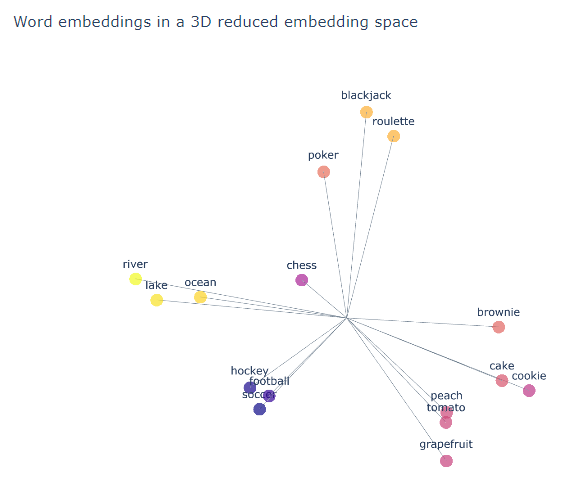

# AI-Learning
This repo is meant to give an overview of LLMs and how to use them in code, directed at high school students.

Work through the noebooks in order. Have Fun!



## Setup
Install the dependencies with:
```bash
conda env create --file environment.yml
```